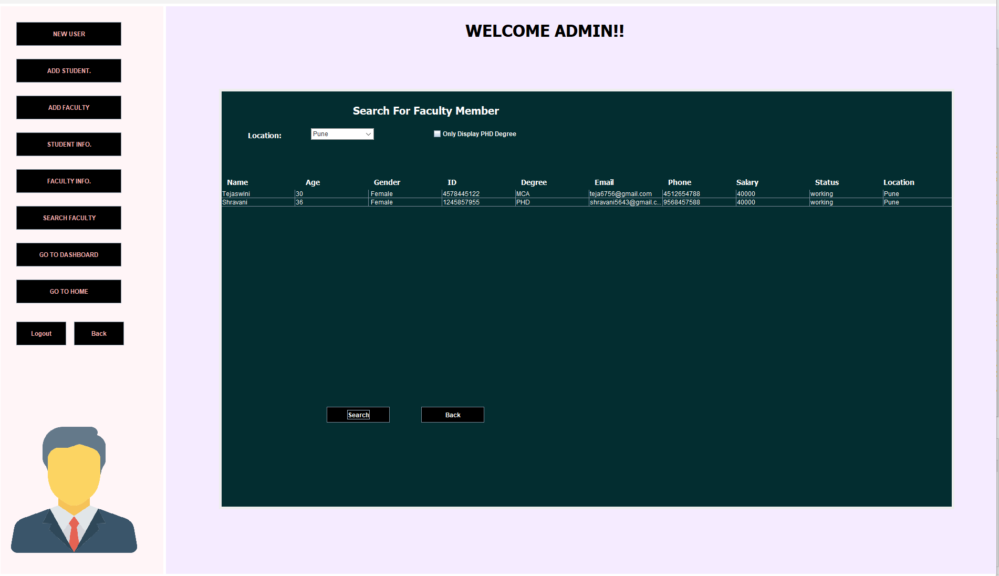
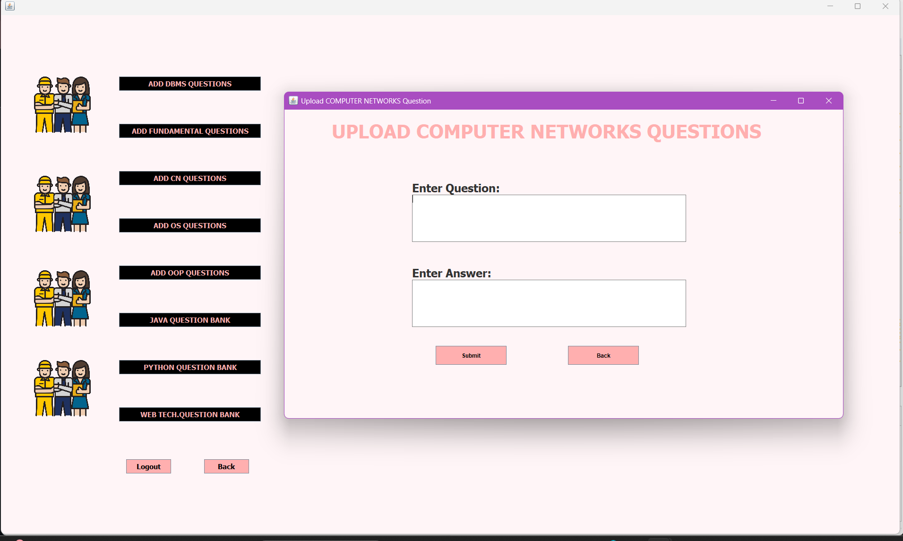
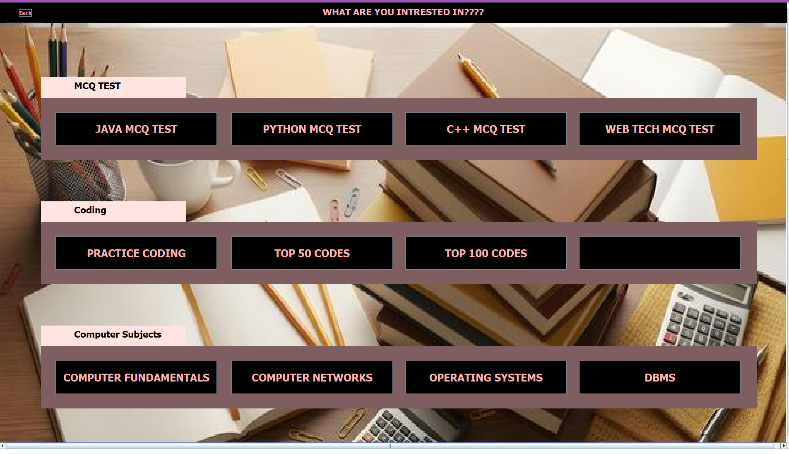
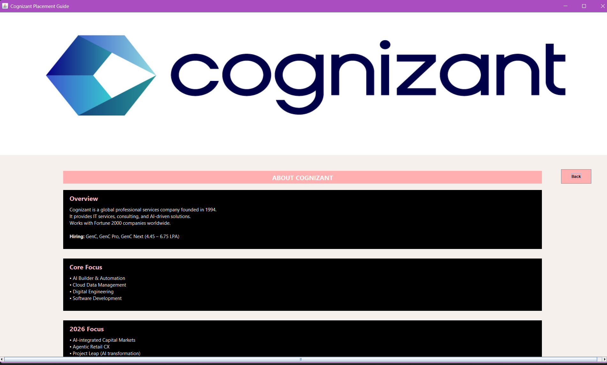

# 📚 Learnify – Guided Learning System
Learnify is an organization-oriented platform developed to enhance learning and interview preparation within educational institutions. Faculty can organize and recommend learning resources, making it easier to navigate the overwhelming amount of information available online. While students gain access to structured study materials creating a streamlined and efficient learning experience.

To further support coding interview preparation, Learnify also offers a curated collection of frequently asked **LeetCode** problems with direct links to the original questions, helping students practice efficiently without spending time searching across multiple platforms.

By centralizing educational resources and coding practice materials, Learnify creates a streamlined, organized, and engaging learning experience for both students and faculty.

---

## ✨ Features

### 👨‍🏫 Faculty Module
- Faculty login and authentication
- Create and manage learning topics
- Upload and organize learning resources
- Recommend study materials
- Manage topic-wise educational content

### 👨‍🎓 Student Module
- Student login and authentication
- Browse learning resources
- Access topic-wise study materials
- View faculty recommendations
- Prepare for coding interviews

### 💻 Coding Interview Repository
- Curated Top LeetCode interview questions
- Direct links to original LeetCode problems
- Easy navigation for coding practice

### 🔐 Authentication
- Admin Login
- Faculty Login
- Student Login
- Role-based access control

---

# 📸 Screenshots

## Login


## Sign Up


## Admin Dashboard


## Faculty Dashboard


## Student Dashboard


## Company Information


## LeetCode Repository


## Question Bank Explorer


## Quiz Module


## Practice MCQ


## Student Dashboard (Resources View)


---

## 🛠 Tech Stack

| Technology | Purpose |
|------------|---------|
| Java | Application Development |
| MySQL | Database Management |
| JDBC | Database Connectivity |
| Git | Version Control |
| GitHub | Repository Hosting |

---

## 📂 Project Structure

```text
Learnify-Guided-Learning-System
│
├── src/              # Java source code
├── database/         # MySQL database script
├── screenshots/      # Project screenshots
├── icon/             # Application icons
├── lib/              # External libraries
├── nbproject/        # NetBeans configuration
├── .gitignore
├── README.md
├── build.xml
└── manifest.mf
```

---

## ⚙️ Installation

### 1. Clone the repository

```bash
git clone https://github.com/YOUR_GITHUB_USERNAME/Learnify.git
```

### 2. Open the project

Import the project into **Apache NetBeans IDE**.

### 3. Create the database

Create a MySQL database named:

```text
interview
```

### 4. Import the database

Import:

```text
database/interview.sql
```

using MySQL Workbench.

### 5. Configure database credentials

Update your MySQL username and password in the database connection class.

### 6. Run the project

Build and run the project from Apache NetBeans IDE.

---

## 📦 Modules

- Authentication
- Student Management
- Faculty Management
- Learning Resource Management
- Topic Management
- LeetCode Repository
- Database Management

---

## 🚀 Future Enhancements

- Guided Learning Paths
- Online Quizzes
- Coding Challenge Submissions
- AI-based Learning Recommendations
- Discussion Forum
- Email Notifications
- Cloud Deployment

---

## 👩‍💻 Developer

**Suhani Shinde**

**MCA Student | Java Developer | DSA Enthusiast | Cloud Learner**

📧 **Email:** shindesuhani535@gmail.com

🔗 **LinkedIn:** https://www.linkedin.com/in/suhani-shinde-236934385

---

## ⭐ Support

If you found this project helpful or interesting, consider giving it a ⭐ on GitHub!


